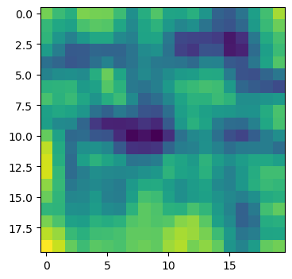

# NumbaSOM
> A Fast Self-Organizing Map Python Library Implemented in Numba.


If you need a **fast and simple to use** SOM library implemented as a 2D lattice or torus, check this out. It utilizes online rather than batch training. 

## Install

`pip install numbasom`

## How to use

Train a SOM on 1000 random 3-dimensional vectors:

```python
import numpy as np
from numbasom import SOM, u_matrix, plot_u_matrix
```

#### Load some data

```python
data = np.random.randn(100,3)
```

#### Initialize the library

```python
som = SOM(som_size=(20,20))
```

#### Train

```python
lattice = som.train(data, num_iterations=1000)
```

    Data scaling took: 0.338414 seconds.
    SOM training took: 1.049132 seconds.


#### Display the value in the first row and first column of the lattice

```python
lattice[1::6,1]
```


    array([[0.72234145, 0.20699402, 0.48731189],
           [0.49514563, 0.18585944, 0.64291118],
           [0.39127316, 0.13052984, 0.4517087 ],
           [0.40195937, 0.42461381, 0.14699424]])


#### Make U-matrix

```python
um = u_matrix(lattice)
```

#### Plot U-matrix

```python
plot_u_matrix(um)
```




