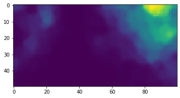

# Welcome to NumbaSOM

> A fast Self-Organizing Map Python library implemented in Numba.

This is a **fast and simple to use** SOM library. It utilizes online training (one data point at the time) rather than batch training. The implemented topologies are a simple 2D lattice or a torus.

## Installation

### With pip

```bash
pip install numbasom
```

### With conda

```bash
conda install -c mnikola numbasom
```

## Quick Start

To import the library:

```python
from numbasom import *
```

A **Self-Organizing Map** is often used to show the underlying structure in data. To demonstrate the library, we'll train it on 200 random 3-dimensional vectors (which we can render as colors).

### Create Sample Data

```python
import numpy as np
data = np.random.random([200, 3])
```

### Initialize the SOM

We initialize a map with 50 rows and 100 columns. The default topology is a 2D lattice. We can also train it on a torus by setting `is_torus=True`.

```python
som = SOM(som_size=(50, 100), is_torus=False)
```

### Train the SOM

We adapt the lattice by iterating 15,000 times through our data points. If we set `normalize=True`, data will be normalized before training.

```python
lattice = som.train(data, num_iterations=15000)
```

```
SOM training took: 0.366633 seconds.
```

### Access Lattice Cells

To access an individual cell:

```python
lattice[5, 3]
```

```
array([0.92550425, 0.20740594, 0.92610555])
```

Slicing also works:

```python
lattice[1::6, 1]
```

The shape of the lattice is (50, 100, 3):

```python
lattice.shape
```

```
(50, 100, 3)
```

### Visualize the Lattice

Since our lattice is made of 3-dimensional vectors, we can represent it as a lattice of colors:

```python
import matplotlib.pyplot as plt

plt.imshow(lattice)
plt.show()
```


## U-Matrix Visualization

Since most data will not be 3-dimensional, we can use the **U-matrix** (unified distance matrix by Alfred Ultsch) to visualize the map and the clusters emerging on it.

```python
um = u_matrix(lattice)
```

Each cell of the U-matrix is a single value representing the average distance to neighbors:

```python
um.shape
```

```
(50, 100)
```

### Plot U-Matrix

The library contains a `plot_u_matrix` function:

```python
plot_u_matrix(um, fig_size=(6.2, 6.2))
```


## Projecting Data

### Project onto the Lattice

To project data onto the lattice, use the `project_on_lattice` function:

```python
colors = np.array([
    [1., 0., 0.], [0., 1., 0.], [0., 0., 1.], [1., 1., 0.],
    [0., 1., 1.], [1., 0., 1.], [0., 0., 0.], [1., 1., 1.]
])
color_labels = ['red', 'green', 'blue', 'yellow', 'cyan', 'purple', 'black', 'white']

projection = project_on_lattice(colors, lattice, additional_list=color_labels)

for p in projection:
    if projection[p]:
        print(p, projection[p][0])
```

```
Projecting on SOM took: 0.158945 seconds.
(0, 85) blue
(2, 39) white
(5, 1) purple
(10, 60) cyan
(41, 59) green
(49, 12) red
(49, 40) yellow
(49, 96) black
```

### Find Closest Vectors

To find every cell's closest vector in the provided data, use `lattice_closest_vectors`:

```python
closest = lattice_closest_vectors(colors, lattice, additional_list=color_labels)
```

```
Finding closest data points took: 0.003056 seconds.
```

```python
closest[(1, 1)]   # ['purple']
closest[(40, 80)] # ['green']
```

You can also get the actual vectors (without labels):

```python
closest_vec = lattice_closest_vectors(colors, lattice)
values = np.array(list(closest_vec.values())).reshape(50, 100, -1)

plt.imshow(values)
plt.show()
```


## Lattice Activations

Compute how each data vector "activates" the lattice:

```python
activations = lattice_activations(colors, lattice)
```

```
Computing SOM activations took: 0.000484 seconds.
```

Show how the vector `blue: [0., 0., 1.]` activates the lattice:

```python
plt.imshow(activations[2])
plt.show()
```


To scale up higher values and scale down lower values, use the `exponent` argument:

```python
activations = lattice_activations(colors, lattice, exponent=8)
```

```
Computing SOM activations took: 0.000838 seconds.
```

```python
plt.imshow(activations[2])
plt.show()
```


